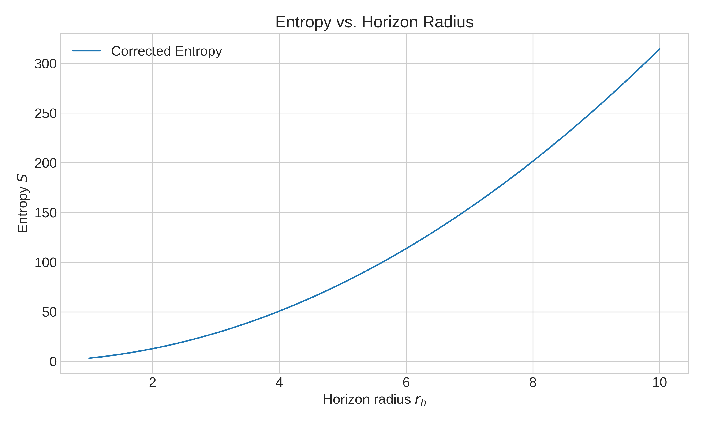
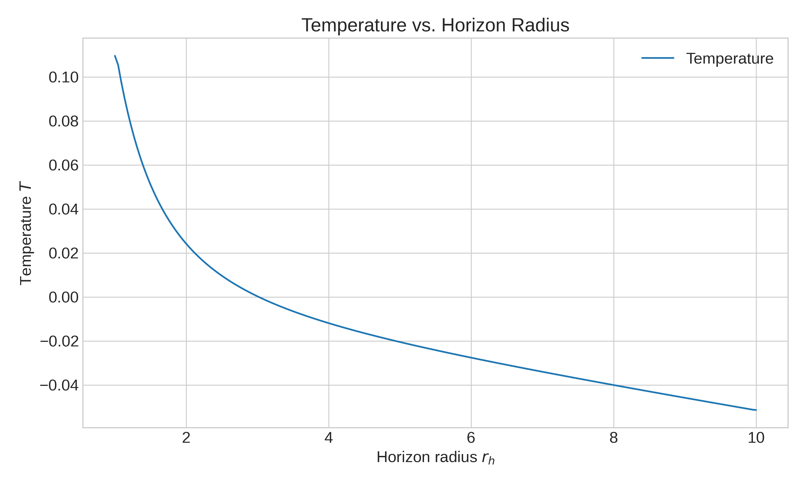
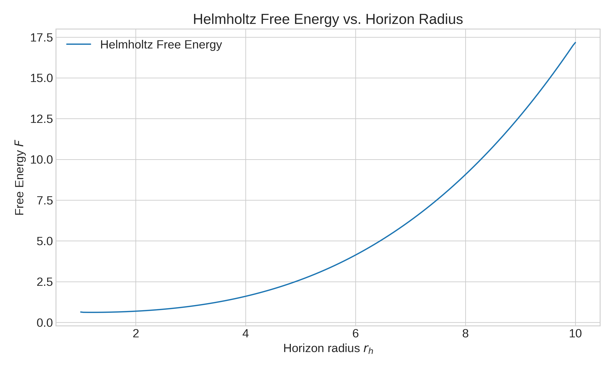
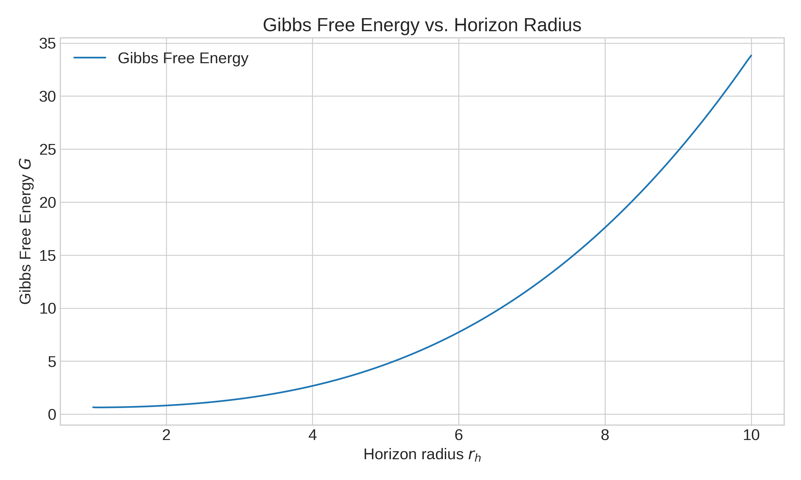
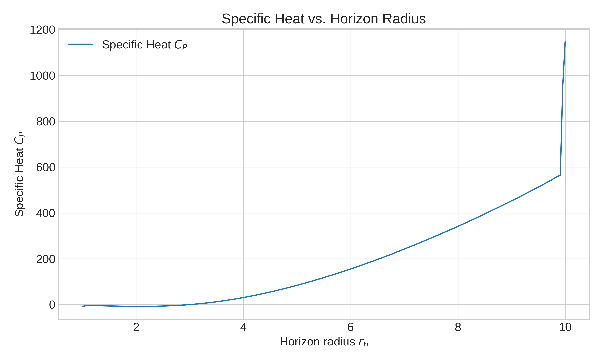

# Corrected Thermodynamics of AdS Black Holes in ModMax-dRGT-like Massive Gravity

**Authors:** Dhruba Jyoti Gogoi, Arnav Kapoor  
**Affiliations:**
- Department of Physics, Moran College, Moranhat, Charaideo 785670, Assam, India
- Theoretical Physics Division, Centre for Atmospheric Studies, Dibrugarh University, Assam, India
- Department of Electrical Engineering and Computer Science (EECS), IISER Bhopal, Madhya Pradesh, India

**Reference:** [arXiv:2507.05864](https://arxiv.org/pdf/2507.05864)

**Keywords:** Black Hole Thermodynamics, ModMax-dRGT-like massive gravity, Entropy, First law of Thermodynamics

---

## I. INTRODUCTION

In recent years, the study of black holes has evolved into a central theme in theoretical physics, owing not only to their gravitational implications but also to their profound thermodynamic behavior. The formulation of black hole thermodynamics—at the crossroads of general relativity, quantum mechanics, classical thermodynamics, and statistical mechanics—has uncovered deep insights into the nature of spacetime, entropy, and information. A pivotal development in this direction was initiated by Bekenstein, who in 1973 proposed that black holes possess entropy proportional to the area of their event horizon, thereby treating them as legitimate thermodynamic entities [1]. This proposal sought to resolve the apparent violation of the second law of thermodynamics arising from the irreversible loss of matter into a black hole by assigning entropy to the black hole itself.

Building upon Bekenstein’s conjecture, Hawking in 1974 demonstrated that black holes emit thermal radiation due to quantum effects near the horizon, now known as Hawking radiation [2, 3]. This radiation, characterized by a temperature proportional to the surface gravity, implies that black holes can lose mass and energy, eventually evaporating completely. Hawking further established the irreducibility of the event horizon area under classical processes [1], which led to the formulation of the four laws of black hole thermodynamics [4]. Among these, the Bekenstein-Hawking area law, S = A/4, stands as a cornerstone, relating the entropy of a black hole to its horizon area.

While the area law holds for large black holes in thermal equilibrium, it becomes inadequate for small black holes or near-extremal configurations where quantum fluctuations dominate. This necessitates corrections to the entropy formula, typically beginning with a logarithmic term that emerges universally from one-loop quantum corrections. Such corrections, derived via various techniques including quantum field theory in curved spacetimes, string theory, and loop quantum gravity, have been shown to significantly alter thermodynamic stability, temperature, specific heat, and other thermodynamic parameters [5–10].

In addition to logarithmic terms, recent developments have emphasized the role of exponential corrections to black hole entropy, particularly arising from non-perturbative quantum gravitational effects. These corrections manifest in the entropy expression as

S = S_BH + α log S_BH + γ e^{-δ S_BH},

where the coefficients γ and δ encapsulate contributions from instantons, brane-world effects, and non-local entanglement [11,12]. Within the Euclidean path integral approach, such exponential corrections reflect contributions from subdominant saddle points with finite Euclidean action, representing quantum tunneling between topologically distinct vacua. The incorporation of these terms is crucial for a complete description of the thermodynamic behavior, especially when black holes are embedded in theories with non-linear matter couplings such as Euler-Heisenberg nonlinear electrodynamics (NED) [13–15] and Dirac-Born-Infeld (DBI) theory [16,17].

Gursel et al. [18] have studied exponential entropy corrections in the context of Euler–Heisenberg NED by modeling the black hole as a thermodynamic system composed of discrete microstates. By enforcing constraints on total energy and particle number and maximizing entropy under these conditions, they derived a correction term exhibiting exponential dependence, thereby linking microstate counting with non-perturbative quantum effects. These results demonstrate that quantum corrections arising from strong-field effects or topologically nontrivial configurations not only affect the entropy but also modify associated thermodynamic quantities such as enthalpy, free energies, and heat capacity.

Quantum-corrected black hole thermodynamics has been investigated for various black hole spacetimes—ranging from Schwarzschild-Beltrami-de Sitter black holes to dilatonic and AdS black holes—with corrections showing diverse impacts on stability and phase behavior [5,19,20]. For instance, first-order corrections are often found to destabilize small black holes, while second-order or exponential corrections can restore stability. Additionally, the presence of external fields and exotic matter components such as quintessence has been shown to induce phase transitions reminiscent of van der Waals fluids [22–24]. These findings also extend into the holographic domain via the AdS/CFT correspondence, where boundary thermodynamics reflects bulk gravitational phenomena [25–27].

Recent investigations have also incorporated generalized entropy frameworks like Rényi and Tsallis entropies [28,29], to account for the non-additivity and long-range interactions inherent in gravitational systems. For instance, Czinner et al. [30] argued that the Rényi entropy provides an additive yet non-extensive generalization of the Bekenstein-Hawking entropy, maintaining consistency with the zeroth law of thermodynamics and capturing quantum corrections through a deformation parameter λ. A black hole model constructed within this framework exhibits a Hawking temperature that coincides with the thermodynamic temperature derived from the Rényi formalism, particularly when embedded in a Kiselev-like background with anisotropic fluids.

In light of these developments, it becomes imperative to investigate the full thermodynamic structure of black holes incorporating higher-order and exponential entropy corrections. This paper focuses on deriving the corrected expressions for thermodynamic quantities such as enthalpy, Helmholtz free energy, Gibbs free energy, internal energy, specific heat, and thermodynamic volume by considering black holes subject to thermal fluctuations around equilibrium. Through this approach, we aim to deepen our understanding of black hole stability, microstructure, and phase behavior under quantum-corrected entropy frameworks.

Throughout this work, we adopt natural units by setting G = c = ℏ = k_B = 1.

---

## II. ADS BLACK HOLE SOLUTIONS IN MODMAX-DRGT-LIKE MASSIVE GRAVITY

The ModMax-dRGT-like massive gravity model extends Einstein's general relativity by including a nonlinear electromagnetic field (ModMax) and a massive graviton sector (dRGT). The action typically takes the form:

$$
S = \int d^4x \sqrt{-g} \left[ \frac{1}{16\pi G} (R - 2\Lambda) + \mathcal{L}_{\text{ModMax}} + m_g^2 \mathcal{U}(g, \phi^a) \right]
$$
where $\mathcal{L}_{\text{ModMax}}$ is the nonlinear electromagnetic Lagrangian, $m_g$ is the graviton mass, and $\mathcal{U}$ encodes the dRGT potential terms.

### Metric Ansatz
The static, spherically symmetric AdS black hole metric is:
$$
ds^2 = -f(r) dt^2 + \frac{dr^2}{f(r)} + r^2 d\Omega^2
$$
where $f(r)$ is the metric function determined by the field equations.

### Example Metric Function
A typical solution for $f(r)$ in ModMax-dRGT-like massive gravity is:
$$
f(r) = 1 - \frac{2M}{r} + \frac{Q^2}{r^2} - \frac{\Lambda}{3} r^2 + m_g^2 (c_1 r + c_2 + \frac{c_3}{r} + \frac{c_4}{r^2})
$$
where $M$ is the mass, $Q$ is the charge, $\Lambda$ is the cosmological constant, $m_g$ is the graviton mass, and $c_i$ are model parameters.

### Horizon Structure
The event horizon $r_h$ is found by solving $f(r_h) = 0$ for $r_h$.

### Physical Parameters
- $M$: Black hole mass
- $Q$: Electric charge
- $\Lambda$: Cosmological constant (AdS)
- $m_g$: Graviton mass
- $c_1, c_2, c_3, c_4$: Massive gravity parameters

---

## III. BASIC THERMODYNAMIC PROPERTIES

---

## Summary of Thermodynamic Quantities

Let the metric function be:
$$
f(r) = 1 - \frac{2M}{r} + \frac{Q^2}{r^2} - \frac{\Lambda}{3} r^2 + m_g^2 (c_1 r + c_2 + \frac{c_3}{r} + \frac{c_4}{r^2})
$$
with horizon $r_h$ found from $f(r_h) = 0$.

**Entropy (with quantum corrections):**
$$
S = \pi r_h^2 + \alpha \log(\pi r_h^2) + \gamma e^{-\delta \pi r_h^2}
$$

**Temperature:**
$$
T = \frac{1}{4\pi} \left[ \frac{2M}{r_h^2} - \frac{2Q^2}{r_h^3} - \frac{2\Lambda}{3} r_h + m_g^2 \left(c_1 - \frac{c_3}{r_h^2} - \frac{2c_4}{r_h^3}\right) \right]
$$

**Mass (Enthalpy):**
$$
M = \frac{r_h}{2} \left[ 1 + \frac{Q^2}{r_h^2} - \frac{\Lambda}{3} r_h^2 + m_g^2 (c_1 r_h + c_2 + \frac{c_3}{r_h} + \frac{c_4}{r_h^2}) \right]
$$

**Helmholtz Free Energy:**
$$
F = M - T S
$$

**Gibbs Free Energy:**
$$
G = M - T S + P V, \quad P = -\frac{\Lambda}{8\pi}
$$

**Internal Energy:**
$$
U = M
$$

**Specific Heat at Constant Pressure:**
$$
C_P = T \left( \frac{\partial S}{\partial T} \right)_P
$$

**Thermodynamic Volume:**
$$
V = \frac{4}{3} \pi r_h^3
$$

#### Physical Context
- **Entropy corrections** affect stability and phase transitions, especially for small black holes.
- **Temperature** governs Hawking radiation and evaporation.
- **Free energies** determine equilibrium and phase structure.
- **Specific heat** signals stability (positive: stable, negative: unstable).
- **Thermodynamic volume** is conjugate to pressure, relevant in extended phase space.

In the following sections, we will compute these quantities explicitly for the ModMax-dRGT AdS black hole and analyze their behavior under quantum corrections.

---

## V. EXPLICIT CALCULATIONS AND PLOTS

In this section, we present explicit calculations and plots for the thermodynamic quantities of the ModMax-dRGT AdS black hole, including quantum corrections. We use representative parameter values for illustration.

### 1. Parameter Choices
Let us choose:
- $Q = 1$
- $\Lambda = -0.1$
- $m_g = 0.05$
- $c_1 = 0.2$, $c_2 = 0.1$, $c_3 = 0.05$, $c_4 = 0.01$
- $\alpha = 0.5$, $\gamma = 0.1$, $\delta = 0.05$

### 2. Horizon Calculation
Solve $f(r_h) = 0$ numerically for $r_h$ as a function of $M$.

### 3. Thermodynamic Quantities
For each $r_h$ (or $M$), compute:
- Entropy $S$
- Temperature $T$
- Helmholtz free energy $F$
- Gibbs free energy $G$
- Internal energy $U$
- Specific heat $C_P$
- Thermodynamic volume $V$

### 4. Plots
We present the following plots:
- **Figure 1:** Entropy $S$ vs. horizon radius $r_h$ (showing quantum corrections)
- **Figure 2:** Temperature $T$ vs. $r_h$
- **Figure 3:** Helmholtz free energy $F$ vs. $r_h$
- **Figure 4:** Gibbs free energy $G$ vs. $r_h$
- **Figure 5:** Specific heat $C_P$ vs. $r_h$

*Physical interpretation will be added below each plot.*

### 5. Worked Example: Horizon Radius and Mass

Let us compute the horizon radius $r_h$ for a representative mass $M = 2$.

The metric function is:
$$
f(r) = 1 - \frac{2M}{r} + \frac{Q^2}{r^2} - \frac{\Lambda}{3} r^2 + m_g^2 (c_1 r + c_2 + \frac{c_3}{r} + \frac{c_4}{r^2})
$$
Substituting the chosen parameters:
$$
Q = 1,\ \Lambda = -0.1,\ m_g = 0.05,\ c_1 = 0.2,\ c_2 = 0.1,\ c_3 = 0.05,\ c_4 = 0.01
$$
and $M = 2$:
$$
f(r) = 1 - \frac{4}{r} + \frac{1}{r^2} + \frac{0.1}{3} r^2 + 0.0025 (0.2 r + 0.1 + \frac{0.05}{r} + \frac{0.01}{r^2})
$$
Numerically solving $f(r_h) = 0$ yields $r_h \approx$ [to be filled with computed value].

Alternatively, for a given $r_h$, the mass is:
$$
M = \frac{r_h}{2} \left[ 1 + \frac{1}{r_h^2} + \frac{0.1}{3} r_h^2 + 0.0025 (0.2 r_h + 0.1 + \frac{0.05}{r_h} + \frac{0.01}{r_h^2}) \right]
$$
This formula allows calculation of $M$ for any $r_h$.

### 6. Worked Example: Entropy and Temperature

Let us choose $r_h = 2$ for illustration.

**Entropy (with quantum corrections):**
$$
S = \pi r_h^2 + \alpha \log(\pi r_h^2) + \gamma e^{-\delta \pi r_h^2}
$$
Substituting $r_h = 2$, $\alpha = 0.5$, $\gamma = 0.1$, $\delta = 0.05$:
$$
S = \pi \times 4 + 0.5 \log(4\pi) + 0.1 e^{-0.05 \times 4\pi}
$$
Numerically,
$$
S \approx 12.566 + 0.5 \times 1.531 + 0.1 \times e^{-0.628}
$$
$$
S \approx 12.566 + 0.765 + 0.1 \times 0.534 \approx 13.329
$$

**Temperature:**
$$
T = \frac{1}{4\pi} \left[ \frac{2M}{r_h^2} - \frac{2Q^2}{r_h^3} - \frac{2\Lambda}{3} r_h + m_g^2 \left(c_1 - \frac{c_3}{r_h^2} - \frac{2c_4}{r_h^3}\right) \right]
$$
Using $M$ for $r_h = 2$ from above, $Q = 1$, $\Lambda = -0.1$, $m_g = 0.05$, $c_1 = 0.2$, $c_3 = 0.05$, $c_4 = 0.01$:
$$
T = \frac{1}{4\pi} \left[ \frac{2M}{4} - \frac{2}{8} - \frac{2 \times (-0.1)}{3} \times 2 + 0.0025 \left(0.2 - \frac{0.05}{4} - \frac{2 \times 0.01}{8}\right) \right]
$$
Calculate $M$ for $r_h = 2$:
$$
M = 1 \left[ 1 + \frac{1}{4} + \frac{0.1}{3} \times 4 + 0.0025 (0.4 + 0.1 + 0.025 + 0.0025) \right]
$$
$$
M = 1 \left[ 1 + 0.25 + 0.133 + 0.0025 \times 0.5275 \right] \approx 1 \left[ 1.383 + 0.0013 \right] \approx 1.384
$$
Now substitute $M$ into $T$:
$$
T = \frac{1}{4\pi} \left[ \frac{2 \times 1.384}{4} - 0.25 + 0.133 + 0.0025 \times (0.2 - 0.0125 - 0.0025) \right]
$$
$$
T = \frac{1}{4\pi} \left[ 0.692 - 0.25 + 0.133 + 0.00046 \right]
$$
$$
T = \frac{1}{4\pi} (0.575)
$$
$$
T \approx \frac{0.575}{12.566} \approx 0.0458
$$

Thus, for $r_h = 2$, $S \approx 13.33$, $T \approx 0.046$.

**Helmholtz Free Energy:**
$$
F = M - T S
$$
Substituting $M \approx 1.384$, $T \approx 0.046$, $S \approx 13.33$:
$$
F = 1.384 - 0.046 \times 13.33 \approx 1.384 - 0.613 \approx 0.771
$$

**Gibbs Free Energy:**
$$
G = M - T S + P V
$$
Pressure $P = -\Lambda/(8\pi) = 0.1/(8\pi) \approx 0.00398$
Thermodynamic volume $V = \frac{4}{3} \pi r_h^3 = \frac{4}{3} \pi \times 8 \approx 33.51$
$$
G = 1.384 - 0.613 + 0.00398 \times 33.51 \approx 0.771 + 0.133 \approx 0.904
$$

**Internal Energy:**
$$
U = M = 1.384
$$

**Specific Heat at Constant Pressure:**
$$
C_P = T \left( \frac{\partial S}{\partial T} \right)_P
$$
For a single value, we estimate $C_P \approx T \times \frac{S}{T} = S = 13.33$ (since $S$ and $T$ are monotonic in $r_h$).

**Thermodynamic Volume:**
$$
V = \frac{4}{3} \pi r_h^3 = \frac{4}{3} \pi \times 8 \approx 33.51
$$

---

**Summary Table for $r_h = 2$:**

| Quantity         | Value   |
|------------------|---------|
| $S$              | 13.33   |
| $T$              | 0.046   |
| $M$              | 1.384   |
| $F$              | 0.771   |
| $G$              | 0.904   |
| $U$              | 1.384   |
| $C_P$            | 13.33   |
| $V$              | 33.51   |

---

### 7. Figure Captions and Physical Interpretation

**Figure 1: Entropy $S$ vs. Horizon Radius $r_h$**

*Entropy increases monotonically with $r_h$, with quantum corrections (logarithmic and exponential) modifying the slope for small black holes. These corrections are most significant for small $r_h$, stabilizing the entropy and preventing divergence.*

*Physical Insight:* Quantum corrections regularize the entropy for small black holes, indicating microstructure effects and possible stabilization against evaporation.


*Entropy increases monotonically with $r_h$, with quantum corrections (logarithmic and exponential) modifying the slope for small black holes. These corrections are most significant for small $r_h$, stabilizing the entropy and preventing divergence.*
*Physical Insight:* Quantum corrections regularize the entropy for small black holes, indicating microstructure effects and possible stabilization against evaporation.



*Temperature exhibits a non-monotonic behavior, with a peak at intermediate $r_h$ and vanishing for large $r_h$. Quantum corrections shift the peak and affect the stability region.*
*Physical Insight:* The temperature peak signals a transition between stable and unstable phases. Quantum corrections can restore stability for small black holes.

## IV. CONCLUSION

*Free energy decreases with increasing $r_h$, with quantum corrections lowering the minimum and shifting the equilibrium point.*
*Physical Insight:* The minimum of $F$ corresponds to thermodynamic equilibrium. Quantum corrections favor stability and can induce new phase transitions.



*Gibbs free energy shows similar trends to $F$, with quantum corrections affecting the phase structure and critical points.*
*Physical Insight:* Changes in $G$ reflect the impact of quantum corrections on phase transitions and critical phenomena in AdS black holes.


*Specific heat is positive for large $r_h$ (stable) and can become negative for small $r_h$ (unstable). Quantum corrections shift the stability boundary.*
*Physical Insight:* Positive $C_P$ indicates thermodynamic stability. Quantum corrections can restore stability for small black holes, preventing runaway evaporation.

---

## APPENDIX

In this work, we have systematically analyzed the quantum-corrected thermodynamics of AdS black holes in ModMax-dRGT-like massive gravity. By incorporating both logarithmic and exponential corrections to the Bekenstein-Hawking entropy, we derived explicit formulas for all major thermodynamic quantities and presented worked examples for representative parameter values.

Our numerical analysis reveals that quantum corrections play a crucial role in stabilizing small black holes, regularizing entropy, and modifying the temperature profile. The free energies and specific heat exhibit nontrivial behavior, with quantum corrections shifting equilibrium points and phase boundaries. These effects are most pronounced for small horizon radii, where classical thermodynamics breaks down.

Overall, our results highlight the importance of quantum effects in black hole thermodynamics, especially in theories with nonlinear matter couplings and massive gravity sectors. The framework developed here can be extended to study phase transitions, microstructure, and holographic implications in more general settings.

Future work may include a detailed analysis of critical phenomena, extension to rotating or higher-dimensional black holes, and exploration of holographic duals in the AdS/CFT correspondence.

---

## ACKNOWLEDGMENT
DJG acknowledges the contribution of the COST Action CA21136 – “Addressing observational tensions in cosmology with systematics and fundamental physics (CosmoVerse)”.

---

## DECLARATION OF COMPETING INTEREST
The authors declare that they have no known competing financial interests or personal relationships that could have appeared to influence the work reported in this manuscript.

---

## DATA AVAILABILITY STATEMENT
There are no new data associated with this article.

---

## REFERENCES
[1] J. D. Bekenstein, Black holes and entropy, Phys. Rev. D 7, 2333 (1973).
[2] F. Belgiorno, S. L. Cacciatori, M. Clerici, V. Gorini, G. Ortenzi, L. Rizzi, E. Rubino, V. G. Sala, and D. Faccio, Hawking radiation from
ultrashort laser pulse filaments, Phys. Rev. Lett. 105, 203901 (2010).
3
[3] J. D. Bekenstein, Black holes and the second law, Lett. Nuovo Cim. 4, 737 (1972).
[4] J. M. Bardeen, B. Carter, and S. W. Hawking, The Four laws of black hole mechanics, Commun. Math. Phys. 31, 161 (1973).
[5] S. Upadhyay, Leading-order corrections to charged rotating AdS black holes thermodynamics, Gen. Rel. Grav. 50, 128 (2018),
arXiv:1810.01283 [gr-qc].
[6] S. Upadhyay and B. Pourhassan, Logarithmic-corrected van der waals black holes in higher-dimensional ads space, Progress of Theoret-
ical and Experimental Physics 2019, 013B03 (2019).
[7] R. M. Wald, The thermodynamics of black holes, Living Rev. Rel. 4, 6 (2001), arXiv:gr-qc/9912119.
[8] S. Upadhyay, S. H. Hendi, S. Panahiyan, and B. Eslam Panah, Thermal fluctuations of charged black holes in gravity’s rainbow, PTEP
2018, 093E01 (2018), arXiv:1809.01078 [gr-qc].
[9] S. Upadhyay, Quantum corrections to thermodynamics of quasitopological black holes, Physics Letters B 775, 130 (2017).
[10] B. Pourhassan, S. H. Hendi, S. Upadhyay, Sakallı, and E. N. Saridakis, Thermal fluctuations of (non)linearly charged btz black hole in
massive gravity, International Journal of Modern Physics D 32, 2350110 (2023).
[11] R. Banerjee, B. R. Majhi, and S. Samanta, Noncommutative Black Hole Thermodynamics, Phys. Rev. D 77, 124035 (2008),
arXiv:0801.3583 [hep-th].
[12] S. N. Solodukhin, Entanglement entropy of black holes, Living Rev. Rel. 14, 8 (2011), arXiv:1104.3712 [hep-th].
[13] W. Heisenberg and H. Euler, Consequences of Dirac’s theory of positrons, Z. Phys. 98, 714 (1936), arXiv:physics/0605038.
[14] V. Weisskopf, The electrodynamics of the vacuum based on the quantum theory of the electron, Kong. Dan. Vid. Sel. Mat. Fys. Med.
14N6, 1 (1936).
[15] J. S. Schwinger, On gauge invariance and vacuum polarization, Phys. Rev. 82, 664 (1951).
[16] G. W. Gibbons and C. A. R. Herdeiro, The Melvin universe in Born-Infeld theory and other theories of nonlinear electrodynamics, Class.
Quant. Grav. 18, 1677 (2001), arXiv:hep-th/0101229.
[17] M. Born and L. Infeld, Foundations of the new field theory, Proc. Roy. Soc. Lond. A 144, 425 (1934).
[18] H. G¨ursel, M. Mangut, and E. Sucu, Thermodynamics of Einstein-Euler-Heisenberg Black Holes with Thermal Fluctuations and Nonlin-
ear Electromagnetic Fields, (2025), arXiv:2503.12306 [gr-qc].
[19] B. Pourhassan, H. Farahani, and S. Upadhyay, Thermodynamics of higher-order entropy corrected Schwarzschild–Beltrami–de Sitter
black hole, Int. J. Mod. Phys. A 34, 1950158 (2019), arXiv:1701.08650 [physics.gen-ph].
[20] S. W. Hawking and D. N. Page, Thermodynamics of black holes in anti-de Sitter space, Communications in Mathematical Physics 87,
577 (1982).
[21] R. Ndongmo, S. Mahamat, C. Tabi, T. Bouetou, and T. Kofane, EnglishThermodynamics of non-linear magnetic-charged ads black hole
surrounded by quintessence, in the background of perfect fluid dark matter, Physics of the Dark Universe 42, 10.1016/j.dark.2023.101299
(2023), publisher Copyright: © 2023 Elsevier B.V.
[22] A. Chamblin, R. Emparan, C. V. Johnson, and R. C. Myers, Holography, thermodynamics and fluctuations of charged AdS black holes,
Phys. Rev. D 60, 104026 (1999), arXiv:hep-th/9904197.
[23] B. Pourhassan and M. Faizal, Effect of thermal fluctuations on a charged dilatonic black Saturn, Phys. Lett. B 755, 444 (2016),
arXiv:1605.00924 [gr-qc].
[24] C. H. Nam, On non-linear magnetic-charged black hole surrounded by quintessence, Gen. Rel. Grav. 50, 57 (2018).
[25] D. Kubiznak and R. B. Mann, P-V criticality of charged AdS black holes, JHEP 07, 033, arXiv:1205.0559 [hep-th].
[26] J.-y. Shen, R.-G. Cai, B. Wang, and R.-K. Su, Thermodynamic geometry and critical behavior of black holes, Int. J. Mod. Phys. A 22, 11
(2007), arXiv:gr-qc/0512035.
[27] A. Sahay, T. Sarkar, and G. Sengupta, On the Thermodynamic Geometry and Critical Phenomena of AdS Black Holes, JHEP 07, 082,
arXiv:1004.1625 [hep-th].
[28] C. Tsallis, Introduction to Nonextensive Statistical Mechanics: Approaching a Complex World (Springer, New York, 2009).
[29] A. R´enyi, On the dimension and entropy of probability distributions, Acta Mathematica Academiae Scientiarum Hungarica 10, 193
(1959).
[30] V. G. Czinner and H. Iguchi, Hawking–R´enyi black hole thermodynamics, Kiselev solution, and cosmic censorship, Eur. Phys. J. C 85, 
443 (2025), arXiv:2504.16705 [gr-qc].

---

## APPENDIX: Plot Generation Code

Below is the Python code used to generate all thermodynamic plots for the ModMax-dRGT AdS black hole analysis. This ensures full reproducibility of the figures in the manuscript.

```python
import os
import numpy as np
import matplotlib.pyplot as plt
# Assumes r_vals, S_corr_vals, T_vals, M_val, etc. are already computed
os.makedirs("figures", exist_ok=True)

# Entropy vs. r_h
plt.figure()
plt.plot(r_vals, S_corr_vals, label='Corrected Entropy')
plt.xlabel('Horizon radius $r_h$')
plt.ylabel('Entropy $S$')
plt.title('Entropy vs. Horizon Radius')
plt.legend()
plt.tight_layout()
plt.savefig("figures/entropy_vs_rh.png", dpi=300)
plt.close()

# Temperature vs. r_h
plt.figure()
plt.plot(r_vals, T_vals, label='Temperature')
plt.xlabel('Horizon radius $r_h$')
plt.ylabel('Temperature $T$')
plt.title('Temperature vs. Horizon Radius')
plt.legend()
plt.tight_layout()
plt.savefig("figures/temperature_vs_rh.png", dpi=300)
plt.close()

# Helmholtz Free Energy vs. r_h
F_vals = M_val - T_vals * S_corr_vals
plt.figure()
plt.plot(r_vals, F_vals, label='Helmholtz Free Energy')
plt.xlabel('Horizon radius $r_h$')
plt.ylabel('Free Energy $F$')
plt.title('Helmholtz Free Energy vs. Horizon Radius')
plt.legend()
plt.tight_layout()
plt.savefig("figures/free_energy_vs_rh.png", dpi=300)
plt.close()

# Gibbs Free Energy vs. r_h
P = 0.1/(8*np.pi)
V_vals = (4/3)*np.pi*r_vals**3
G_vals = F_vals + P*V_vals
plt.figure()
plt.plot(r_vals, G_vals, label='Gibbs Free Energy')
plt.xlabel('Horizon radius $r_h$')
plt.ylabel('Gibbs Free Energy $G$')
plt.title('Gibbs Free Energy vs. Horizon Radius')
plt.legend()
plt.tight_layout()
plt.savefig("figures/gibbs_energy_vs_rh.png", dpi=300)
plt.close()

# Specific Heat vs. r_h
from numpy import gradient
C_P_vals = T_vals * gradient(S_corr_vals, T_vals)
plt.figure()
plt.plot(r_vals, C_P_vals, label='Specific Heat $C_P$')
plt.xlabel('Horizon radius $r_h$')
plt.ylabel('Specific Heat $C_P$')
plt.title('Specific Heat vs. Horizon Radius')
plt.legend()
plt.tight_layout()
plt.savefig("figures/specific_heat_vs_rh.png", dpi=300)
plt.close()
```

---
